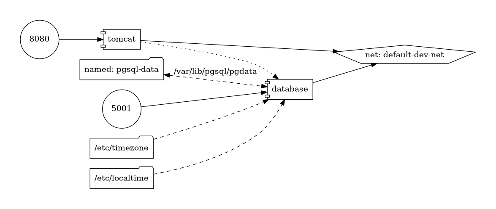

# RSData | JSF PF Starter Application (WiP)

Projeto inicial na RSData para familiarização com JavaServer Faces e PrimeFaces. O escopo básico está sendo Baseado neste [curso](https://www.youtube.com/watch?v=ezwgBvsd6Ps) da AlgaWorks.

## TOC

<!-- TOC -->

- [RSData | JSF PF Starter Application WiP](#rsdata--jsf-pf-starter-application-wip)
    - [TOC](#toc)
    - [O projeto](#o-projeto)
        - [Topologia](#topologia)
        - [Ambientes](#ambientes)
            - [Desenvolvimento](#desenvolvimento)
    - [Manipulação do projeto](#manipula%C3%A7%C3%A3o-do-projeto)
        - [Startup](#startup)
            - [Desenvolvimento](#desenvolvimento)
        - [Shutdown](#shutdown)
    - [O que deseja fazer?](#o-que-deseja-fazer)

<!-- /TOC -->

## O projeto

### Topologia

Em experiências profissionais pregressas, nas quais o ecossistema do Docker havia sido implantado, desenvolvi e ao longo do tempo aperfeiçoei uma infrestrutura de de declarações de imagens, manifestos de serviços e o encadeamento lógico dos scripts que consomem esses recursos. Utiliza simplesmente a estrutura que o próprio `make` proporciona para convergir comandos que executam tarefas que manipulam a base de código (e.g. `build`, `clear`), com a diferença de que a estrutura do Docker Compose foi encaixada na mesma.

Para este projeto em particular, adaptei esse esquema da seguinte forma:


```bash
./infra
├── docker
│   ├── develop                     # Infra do ambiente de desenvolvimento (similar para produção)
│   │   ├── tomcat                  # Servidor Apache Tomcat v8.5.6
│   │   ├── database                # Serviço PostgreSQL (banco de dados relacional)
│   │   └── docker-compose.yml      # Declaração dos serviços em manifesto YAML
│   └── production                  # Estrutura similar para produção)
│       └── ...
├── resources                       # Recursos estáticos associados à documentação do projeto e correlatos
├── companyman                      # Implementação da aplicação JSF/PF propriamente dita
│   └── ...
├── scripts                         # Pasta com scripts que facilitam a automação do projeto
├── Makefile                        # Agrega os comandos 'make' que facilitam a manipulação do Docker Compose e dos scripts na pasta supracitada
└── README.md                       # Raíz da documentação
```

Através do `make`, via scripts de automação do Docker Compose implementados em um [Makefile](./Makefile), na raíz do projeto. Para conferir a documentação de cada script, basta executar no terminal

```bash
make                                        # Sem nenhum comando, executa o fallback 'help'
make help                                   # Explicitamente, mostra a documentação
```

### Ambientes

#### Desenvolvimento

O ambiente de desenvolvimento, construído nesse repositório, foi pensado de forma a simular a integração entre os potenciais serviços distribuídos que podem compôr a platorma de software. O diagrama abaixo ilustra como se dá esta integração.

- Manifesto dos serviços para este ambiente: [`./infra/docker/develop/docker-compose.yml`](./infra/docker/develop/docker-compose.yml)

---
---

<details>
<summary><big>Mostrar diagrama da topologia</big></summary>



</details>

---
---

> [!NOTE]
>
> Esse diagrama foi gerado com o [`docker-compose-viz`](https://github.com/pmsipilot/docker-compose-viz), que é um gerador de grafos direcionados, que recebe como entrada o manifesto YML do Docker Compose para os serviços em questão. Para gerar ou atualizar o diagrama acima, basta executar:
> 
> ```bash
> make topology
> ```

## Manipulação do projeto

### Startup

Na raíz do projeto, execute os seguintes comandos:

#### Desenvolvimento

```bash
$ make build env=dev                # Realiza o build das imagens de todos os serviços, em ./infra/docker/develop/[nome-do-serviço]/Dockerfile
$ make start env=dev c=database     # Inicia o banco de dados PostgreSQL, em modo detached (sem logs)  
$ make start env=dev c=tomcat       # Inicia o Apache Tomcat, em modo detached (sem logs)
```

> [!IMPORTANT]
> Para se certificar de que os conteineres foram de fato devidamente iniciados e na escuta das portas corretas, basta executar o comando `make ps env=[dev | prod]`.
> Para ver os logs de um conteiner específico, execute `make logs env=[dev | prod] c=[nome-do-serviço]`.

### Shutdown

Similarmente, para ambos os ambientes, de modo a encerrar a execução de todos os contêineres, basta rodar:

```bash
make stop env=[dev | prod]          # Interrompe todos os contêineres para um ambiente
make clean env=[dev | prod]         # Opcional. Remove os contêineres e a network associadas aos serviços do ambiente
```

---

## O que deseja fazer?

- [Voltar para o topo](#toc)
- [Release notes](./resources/docs/md/release-notes.md)
