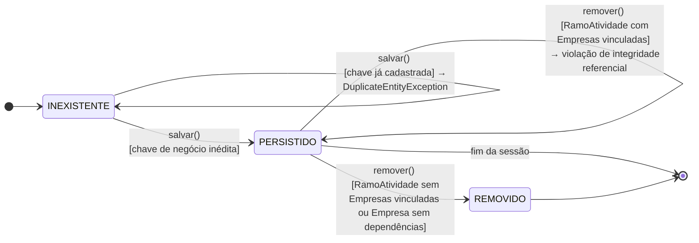
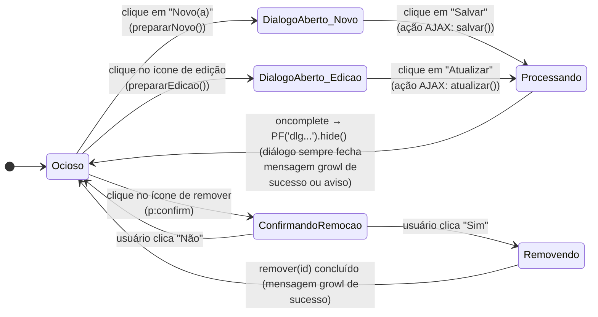

# RSData | CompanyMAN | Regras de negócio

## TOC

<!-- TOC -->

- [RSData | CompanyMAN | Regras de negócio](#rsdata--companyman--regras-de-neg%C3%B3cio)
    - [TOC](#toc)
    - [Introdução](#introdu%C3%A7%C3%A3o)
    - [Ciclo de vida de persistência do registro](#ciclo-de-vida-de-persist%C3%AAncia-do-registro)
        - [Observações](#observa%C3%A7%C3%B5es)
    - [Estado da interação na interface diálogos PrimeFaces](#estado-da-intera%C3%A7%C3%A3o-na-interface-di%C3%A1logos-primefaces)
        - [Observações](#observa%C3%A7%C3%B5es)
    - [O que deseja fazer?](#o-que-deseja-fazer)

<!-- /TOC -->

## Introdução

O sistema é um CRUD simples e **não modela nenhum atributo de status de negócio** (não há, por exemplo, "empresa ativa/inativa" ou um fluxo de aprovação). Por isso, máquinas de estado só são aplicáveis a dois aspectos do sistema:

1. O **ciclo de vida de persistência** de um registro (`Empresa` ou `RamoAtividade`), do ponto de vista da camada de serviço/banco de dados.
2. O **estado de interação da interface** (diálogos PrimeFaces de criação/edição/remoção), do ponto de vista da camada de apresentação.

Ambos são idênticos para as duas entidades do domínio (`Empresa` e `RamoAtividade`), variando apenas a exceção específica lançada em caso de duplicidade.

## Ciclo de vida de persistência do registro

Aplica-se igualmente a `Empresa` (chave de negócio: `cnpj`) e a `RamoAtividade` (chave de negócio: `descricao`).

### Observações
 
- A transição `INEXISTENTE → PERSISTIDO` só ocorre após a validação de duplicidade em `EmpresaService.salvar()` / `RamoAtividadeService.salvar()`.
- `remover()` primeiro verifica a existência do registro (`buscarPorId`), lançando `EntityNotFoundException` caso não exista (transição implícita "tentativa sobre estado `REMOVIDO`/`INEXISTENTE`", omitida do diagrama por não alterar estado).
- A restrição de `RamoAtividade` só ser removido sem empresas associadas é garantida pelo banco de dados (constraint `NOT NULL` + FK), não pela camada de serviço.

## Estado da interação na interface (diálogos PrimeFaces)

Representa o comportamento do formulário de cadastro/edição e da confirmação de remoção, comuns às telas `empresa/index.xhtml` e `ramoAtividade/index.xhtml`.

### Observações

- O callback `oncomplete="PF('dlgNovo').hide()"` é disparado **sempre** ao final da requisição AJAX, independentemente de o backend ter lançado `DuplicateEntityException` ou não. Ou seja, mesmo em caso de duplicidade, o diálogo é fechado e o aviso é exibido apenas via `p:growl` — o usuário precisa reabrir o diálogo e reinserir os dados caso deseje corrigir. Isso está documentado aqui como comportamento real do sistema (não como requisito), sendo uma oportunidade de melhoria futura (ex.: usar `<f:event>`/`update` condicional para manter o diálogo aberto em caso de erro de validação). 
- Não há estado de "carregando lista" separado — a listagem (`getLista()`) é recalculada de forma *lazy* sempre que `lista == null`, o que ocorre automaticamente após qualquer `salvar`, `atualizar` ou `remover` bem-sucedido (o bean invalida o cache atribuindo `lista = null`).

---

## O que deseja fazer?

- [Voltar ao topo](#toc)
- [Voltar à raíz](../../../README.md)
- [Entidades de domínio](./02-entidades-dominio.md)
- [Casos de uso](./03-casos-de-uso.md)
- [Sequências](./04-sequencias-principais.md)
- [Release notes](./05-release-notes.md)
