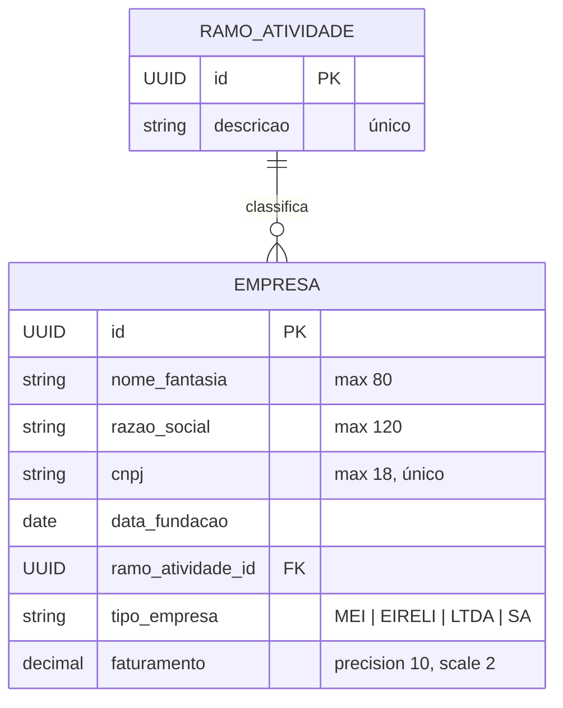

# RSData | CompanyMAN | Entidades de domínio

## TOC

<!-- TOC -->

- [RSData | CompanyMAN | Entidades de domínio](#rsdata--companyman--entidades-de-dom%C3%ADnio)
    - [TOC](#toc)
    - [Introdução](#introdu%C3%A7%C3%A3o)
    - [Entidades](#entidades)
        - [Ramo de atividade classe RamoAtividade](#ramo-de-atividade-classe-ramoatividade)
        - [Empresa classe Empresa](#empresa-classe-empresa)
    - [Categorias](#categorias)
        - [Tipo de empresa enum TipoEmpresa](#tipo-de-empresa-enum-tipoempresa)
    - [Relacionamento entre os domínios](#relacionamento-entre-os-dom%C3%ADnios)
    - [Camadas que operam sobre o domínio](#camadas-que-operam-sobre-o-dom%C3%ADnio)
    - [Limitações conhecidas do modelo atual](#limita%C3%A7%C3%B5es-conhecidas-do-modelo-atual)
    - [O que deseja fazer?](#o-que-deseja-fazer)

<!-- /TOC -->

## Introdução

Este documento descreve os principais domínios do sistema de gerenciamento de Empresas e ramos de atividade, suas entidades, atributos, invariantes de negócio e relacionamentos.

O sistema possui dois agregados principais:

- **RamoAtividade** — classifica o segmento econômico em que uma empresa atua.
- **Empresa** — representa uma pessoa jurídica cadastrada no sistema, sempre associada a exatamente um ramo de atividade.

Há ainda um objeto de valor (*value object*) que não é uma tabela própria:

- **TipoEmpresa** — enumeração da natureza jurídica da empresa (`MEI`, `EIRELI`, `LTDA`, `SA`), persistida como `string` diretamente na coluna `empresa.tipo_empresa` (`EnumType.STRING`).

## Entidades

### Ramo de atividade (classe `RamoAtividade`)

| Atributo    | Tipo   | Restrições                                                    | Coluna (DB) |
|-------------|--------|---------------------------------------------------------------|-------------|
| `id`        | UUID   | PK, gerado automaticamente (`GenerationType.UUID`)            | `id`        |
| `descricao` | String | Obrigatório, até 150 caracteres, **único** (case-insensitive) | `descricao` |

**Tabela:** `ramo_atividade`

**Regras de negócio incidentes:**

- Não é permitido cadastrar dois ramos de atividade com a mesma descrição, ignorando maiúsculas/minúsculas (`buscarPorDescricao` faz `lower(...)`).
- A igualdade (`equals`/`hashCode`) é definida pela `descricao`, e não pelo `id` — duas instâncias com a mesma descrição são consideradas o mesmo ramo de atividade mesmo antes de serem persistidas.
- Um ramo de atividade **não pode ser removido** enquanto houver Empresas vinculadas a ele, pois a coluna `empresa.ramo_atividade_id` é `NOT NULL` e possui uma *foreign key* (`fk_empresa_ramo_atividade`) sem regra de
  cascata — o banco rejeita a exclusão com uma violação de integridade referencial.

### Empresa (classe `Empresa`)

| Atributo        | Tipo                       | Restrições                                   | Coluna (DB)              |
|-----------------|----------------------------|----------------------------------------------|--------------------------|
| `id`            | UUID                       | PK, gerado automaticamente                   | `id`                     |
| `nomeFantasia`  | String                     | Obrigatório, até 80 caracteres               | `nome_fantasia`          |
| `razaoSocial`   | String                     | Obrigatório, até 120 caracteres              | `razao_social`           |
| `cnpj`          | String                     | Obrigatório, até 18 caracteres, **único**    | `cnpj`                   |
| `dataFundacao`  | Date (`TemporalType.DATE`) | Obrigatório                                  | `data_fundacao`          |
| `ramoAtividade` | RamoAtividade              | Obrigatório (`@ManyToOne`, `FetchType.LAZY`) | `ramo_atividade_id` (FK) |
| `tipoEmpresa`   | TipoEmpresa (enum)         | Obrigatório (`EnumType.STRING`)              | `tipo_empresa`           |
| `faturamento`   | BigDecimal                 | Obrigatório, `precision=10, scale=2`         | `faturamento`            |

**Tabela:** `empresa`

**Regras de negócio incidentes:**

- Não é permitido cadastrar duas empresas com o mesmo CNPJ (`buscarPorCnpj`, verificação feita na camada de serviço antes do `INSERT`/`UPDATE`, reforçada pela *unique constraint* `uk_empresa_cnpj`).
- A igualdade (`equals`/`hashCode`) é definida pelo `cnpj` — a chave de negócio da empresa.
- Toda empresa deve referenciar um ramo de atividade e um Tipo de Empresa válidos; ambos são de preenchimento obrigatório nos formulários de cadastro/edição (PrimeFaces `required="true"`).

## Categorias

### Tipo de empresa (enum `TipoEmpresa`)

| Código   | Descrição                                       |
|----------|-------------------------------------------------|
| `MEI`    | Microempreendedor Individual                    |
| `EIRELI` | Empresa Individual de Responsabilidade Limitada |
| `LTDA`   | Sociedade Limitada                              |
| `SA`     | Sociedade Anônima                               |

> **Observação**
>
> Não possui tabela própria nem ciclo de vida independente — é apenas um atributo classificatório da empresa.

## Relacionamento entre os domínios

- **RamoAtividade (1):(N) Empresa**: um ramo de atividade pode ser associado a várias empresas; uma empresa pertence a exatamente um ramo de atividade (associação obrigatória, sem cascata de remoção).

## 6. Camadas que operam sobre o domínio

| Camada     | Classe                                                       | Responsabilidade                                                  |
|------------|--------------------------------------------------------------|-------------------------------------------------------------------|
| Model      | `Empresa`, `RamoAtividade`, `TipoEmpresa`                    | Representação das entidades e do objeto de valor                  |
| DAO        | `EmpresaDAO`, `RamoAtividadeDAO`, `GenericDAO(Impl)`         | Acesso a dados via `EntityManager` (JPA/Hibernate)                |
| Service    | `EmpresaService`, `RamoAtividadeService`                     | Regras de negócio (unicidade, existência) antes de delegar ao DAO |
| Controller | `EmpresaBean`, `RamoAtividadeBean`, `RamoAtividadeConverter` | Managed beans CDI que conectam a View às regras de negócio        |
| Exception  | `DuplicateEntityException`, `EntityNotFoundException`        | Sinalizam violações das invariantes de domínio                    |

## Limitações conhecidas do modelo atual

- Não há um atributo de **status** (ex.: ativo/inativo) em nenhuma das entidades — por isso os diagramas de estado deste projeto (vide [regras de negócio](./01-regras-de-negocio.md)) descrevem o **ciclo de vida de persistência** dos registros e o **estado da interação na interface**, e não uma máquina de estados de negócio explícita.
- A remoção de `RamoAtividade` vinculado a `Empresa`s resulta em exceção de integridade referencial não tratada de forma amigável na camada de apresentação atual (não há mensagem de negócio específica para esse caso — é uma oportunidade de evolução).

---

## O que deseja fazer?

- [Voltar ao topo](#toc)
- [Voltar à raíz](../../../README.md)
- [Regras de negócio](./01-regras-de-negocio.md)
- [Casos de uso](./03-casos-de-uso.md)
- [Sequências principais](./04-sequencias-principais.md)
- [Release notes](./05-release-notes.md)
