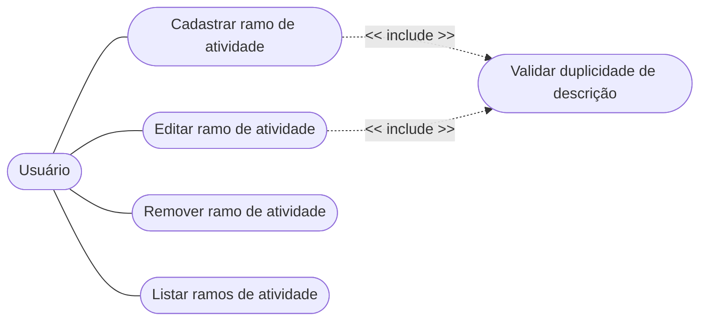
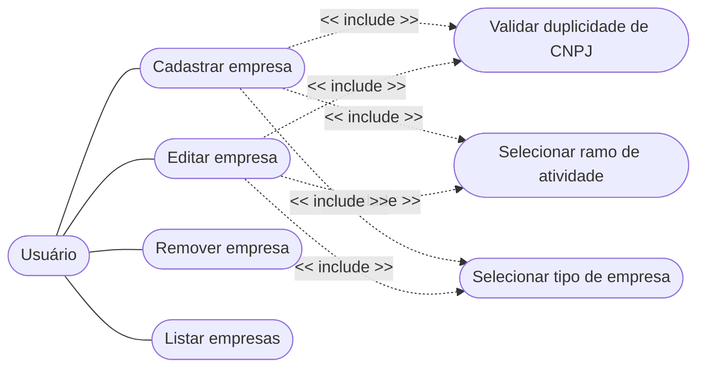
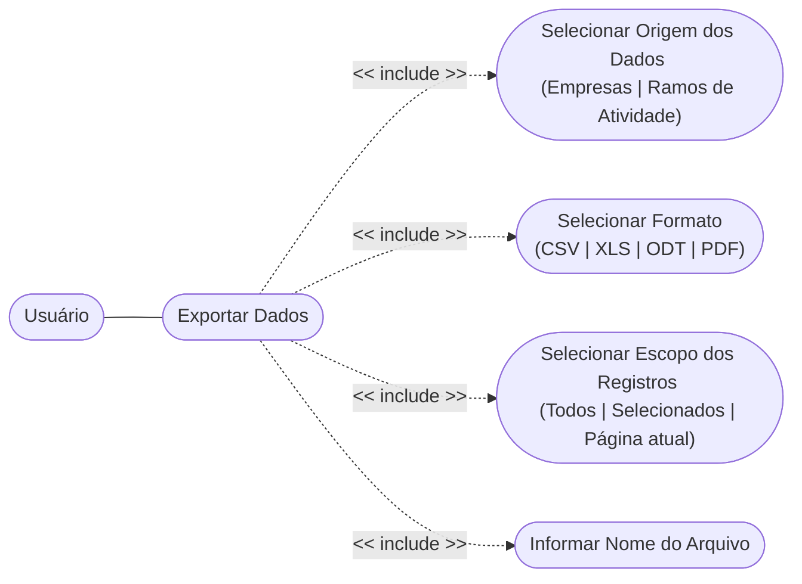

# RSData | CompanyMAN | Casos de uso

## TOC

<!-- TOC -->

- [RSData | CompanyMAN | Casos de uso](#rsdata--companyman--casos-de-uso)
    - [TOC](#toc)
    - [Introdução](#introdu%C3%A7%C3%A3o)
        - [Observação acerca da notação](#observa%C3%A7%C3%A3o-acerca-da-nota%C3%A7%C3%A3o)
    - [Ator do sistema](#ator-do-sistema)
    - [Diagrama geral](#diagrama-geral)
    - [UC1-UC4 e UCX - Gerenciar ramos de atividade](#uc1-uc4-e-ucx---gerenciar-ramos-de-atividade)
        - [Encadeamento lógico](#encadeamento-l%C3%B3gico)
    - [UC5-UC8 e UCX-UCZ - Gerenciar Empresas](#uc5-uc8-e-ucx-ucz---gerenciar-empresas)
        - [Encadeamento lógico](#encadeamento-l%C3%B3gico)
    - [UC11 e UCV-UCU: Exportar Dados modal unificado](#uc11-e-ucv-ucu-exportar-dados-modal-unificado)
    - [Rastreabilidade](#rastreabilidade)
    - [O que deseja fazer?](#o-que-deseja-fazer)

<!-- /TOC -->

## Introdução

Nesta seção, segue-se uma apresentação mais aprofundada dos conceitos que norteiam os casos de uso implmentados na plataforma, resultando na representação diagramática dos mesmos.

### Observação acerca da notação

O Mermaid (ferramenta usada para os demais diagramas deste projeto) não possui um tipo nativo de "diagrama de casos de uso" UML. Os diagramas abaixo são expressos com a sintaxe de *flowchart* do Mermaid, usando a forma "estádio" (`([...])`) para representar os casos de uso (elipses UML), retângulos para o ator e setas tracejadas com rótulo `<< include >>` para representar a relação de inclusão — preservando a semântica UML padrão.

## Ator do sistema

O sistema possui um único ator, sem diferenciação de papéis/autenticação na implementação atual:

- **Usuário** — pessoa responsável por manter o cadastro de Empresas e de Ramos de Atividade.

## Diagrama geral

Aqui todos os casos de uso associados ao que um usuário é permitido fazer no sistema são ilustrados. No que tange à identificação mais precisa destes casos de uso, para efeito de referenciamento em outras seções dessa documentação, os mesmos estão sendo indexados da seguinte forma:

- Requisitos funcionais:
    - Gerenciar ramos de atividades:
        - UC1: Cadastrar ramo de atividade
        - UC2: Editar ramo de atividade
        - UC3: Remover ramo de atividade
        - UC4: Listar ramos de atividade
    - Gerenciar empresas:
        - UC5: Cadastrar empresa
        - UC6: Editar empresa
        - UC7: Remover empresa
        - UC8: Listar empresas
    - Exportação de dados:
        - UC11: Exportar dados (modal unificado)
        - UCV: Selecionar origem dos dados (empresas | ramos de atividade)
        - UCW: Selecionar formato de exportação (CSV | XLS | ODT | PDF)
        - UCT: Selecionar escopo dos registros (Todos | Selecionados | Página atual)
        - UCU: Informar nome do arquivo
- Requisitos transversais:
    - UCX: Validar duplicidade pela chave de entidade correspondente, i.e. empresa (CNPJ) e ramo de atividade (descrição)
    - UCY: Selecionar ramo de atividade
    - UCZ: Selecionar tipo de empresa    
- Requisitos não-funcionais:
    - UC00: Inicialização da aplicação criação de schema e seed de dados

De modo geral, esse é o encadeamento lógico da interação de um usuário com o sistema:

```mermaid
flowchart
    direction TB
    Usuario(["Usuário"])

    subgraph SIS["RSData CompanyMAN"]
        direction TB

        subgraph PKG1["Gerenciar ramos de atividade"]
            direction TB
            UC1(["Cadastrar ramo de atividade"])
            UC2(["Editar ramo de atividade"])
            UC3(["Remover ramo de atividade"])
            UC4(["Listar ramos de atividade"])
        end

        subgraph PKG2["Gerenciar empresas"]
            direction TB
            UC5(["Cadastrar Empresa"])
            UC6(["Editar Empresa"])
            UC7(["Remover Empresa"])
            UC8(["Listar Empresas"])
        end

        UC11(["Exportar dados <br/>(modal unificado)"])

        UCX(["Validar duplicidade <br/>(chave de entidade)"])
        UCY(["Selecionar ramo de atividade"])
        UCZ(["Selecionar Tipo de Empresa"])
        UCV(["Selecionar origem dos dados <br/>(empresas | ramos de atividade)"])
        UCW(["Selecionar formato de exportação <br/>(CSV | XLS | ODT | PDF)"])
        UCT(["Selecionar escopo dos registros <br/>(Todos | Selecionados | Página atual)"])
        UCU(["Informar nome do arquivo <br/>(nome padrão como fallback; <br/>pasta escolhida no 'Salvar Como' do navegador)"])
    end

    Usuario --- UC1
    Usuario --- UC2
    Usuario --- UC3
    Usuario --- UC4
    Usuario --- UC5
    Usuario --- UC6
    Usuario --- UC7
    Usuario --- UC8
    Usuario --- UC11

    UC1 -.->|"<< include >>"| UCX
    UC2 -.->|"<< include >>"| UCX
    UC5 -.->|"<< include >>"| UCX
    UC6 -.->|"<< include >>"| UCX

    UC5 -.->|"<< include >>"| UCY
    UC6 -.->|"<< include >>"| UCY

    UC11 -.->|"<< include >>"| UCV
    UC11 -.->|"<< include >>"| UCW
    UC11 -.->|"<< include >>"| UCT
    UC11 -.->|"<< include >>"| UCU
```

## UC1-UC4 e UCX - Gerenciar ramos de atividade

> **Observação:**
>
> A remoção de um ramo de atividade é bloqueada pelo banco de dados caso existam Empresas vinculadas a ele (vide [sequência](./04-sequencias-principais.md#L77) correspondente). Essa restrição é uma regra de integridade
> referencial, não uma relação `<<extend>>` formal entre casos de uso, por isso não foi representada como aresta no diagrama.

### Encadeamento lógico

| Caso de uso                 | Ator    | Pré-condição                   | Pós-condição                                            |
|-----------------------------|---------|--------------------------------|---------------------------------------------------------|
| Cadastrar Ramo de Atividade | Usuário | Descrição informada            | Novo registro persistido; erro se descrição já existir  |
| Editar Ramo de Atividade    | Usuário | Registro selecionado existente | Descrição atualizada; erro se nova descrição já existir |
| Remover Ramo de Atividade   | Usuário | Registro selecionado existente | Registro removido; erro se houver Empresas vinculadas   |
| Listar Ramos de Atividade   | Usuário | —                              | Tabela paginada exibida na tela                         |

## UC5-UC8 e UCX-UCZ - Gerenciar Empresas

### Encadeamento lógico

| Caso de uso       | Ator    | Pré-condição                                                                                                     | Pós-condição                                                                              |
|-------------------|---------|------------------------------------------------------------------------------------------------------------------|-------------------------------------------------------------------------------------------|
| Cadastrar Empresa | Usuário | Nome fantasia, razão social, CNPJ, data de fundação, ramo de atividade, tipo de empresa e faturamento informados | Nova empresa persistida; erro se CNPJ já existir                                          |
| Editar Empresa    | Usuário | Empresa selecionada existente                                                                                    | Dados atualizados; erro se novo CNPJ pertencer a outra empresa                            |
| Remover Empresa   | Usuário | Empresa selecionada existente; confirmação do usuário                                                            | Empresa removida do sistema                                                               |
| Listar Empresas   | Usuário | —                                                                                                                | Tabela paginada exibida, com o nome do ramo de atividade e a descrição do tipo de empresa |

## UC11 e UCV-UCU: Exportar Dados (modal unificado)

Acessível pelo menu superior em **qualquer** tela — não pertence exclusivamente ao pacote de Empresas nem ao de Ramos de Atividade.

**Descrição textual do caso de uso:**

| Caso de uso    | Ator    | Pré-condição                                                                                                                                        | Pós-condição                                                                                                                                                                                                                                                                               |
|----------------|---------|-----------------------------------------------------------------------------------------------------------------------------------------------------|--------------------------------------------------------------------------------------------------------------------------------------------------------------------------------------------------------------------------------------------------------------------------------------------|
| Exportar Dados | Usuário | Origem (Empresas/Ramos de Atividade), formato (CSV/XLS/ODT/PDF) e escopo (Todos/Selecionados/Página atual) selecionados; nome do arquivo é opcional | Arquivo gerado com os registros do escopo escolhido (total geral, seleção da tabela, ou página atual); o navegador abre o diálogo nativo "Salvar Como" (Chrome, Brave, Edge) ou inicia o download padrão (Firefox), com o nome informado ou um nome padrão com data/hora, se não informado |

## Rastreabilidade

De modo também que o desenvolvedor entenda como os casos de uso supracitados foram componentizados, segue abaixo um breve encadeamento, à luz do padrão de projeto MVC, de como os mesmos foram implementados no contexto de JavaServer Faces e PrimeFaces:

| Caso de uso                                       | Managed Bean                                      | Serviço                                                                                                                                                                                                      | Tela (View)                                                                    |
|---------------------------------------------------|---------------------------------------------------|--------------------------------------------------------------------------------------------------------------------------------------------------------------------------------------------------------------|--------------------------------------------------------------------------------|
| Cadastrar/Editar/Remover/Listar Ramo de Atividade | `RamoAtividadeBean`                               | `RamoAtividadeService`                                                                                                                                                                                       | `ramoAtividade/index.xhtml`                                                     |
| Cadastrar/Editar/Remover/Listar Empresa           | `EmpresaBean`                                     | `EmpresaService`                                                                                                                                                                                             | `empresa/index.xhtml`                                                           |
| Exportar Dados (Empresas ou Ramos de Atividade)   | `ExportBean` (opções) + JavaScript (orquestração) | `ExportDownloadServlet` + `EmpresaBean`/`RamoAtividadeBean` (seleção/paginação, via CDI) + `EmpresaService`/`RamoAtividadeService` + `EmpresaExportService`/`RamoAtividadeExportService` + `TabularExporter` | `dialogs/exportar-dados/index.xhtml` (incluído globalmente via `layout.xhtml`) |

---

## O que deseja fazer?

- [Voltar ao topo](#toc)
- [Voltar à raíz](../../../README.md)
- [Regras de negócio](./01-regras-de-negocio.md)
- [Entidades de domínio](./02-entidades-dominio.md)
- [Sequências principais](./04-sequencias-principais.md)
- [Validação e exportação](./05-validacao-exportacao.md)
- [Release notes](./06-release-notes.md)
- [Referência rápida](./07-referencia-rapida.md)
