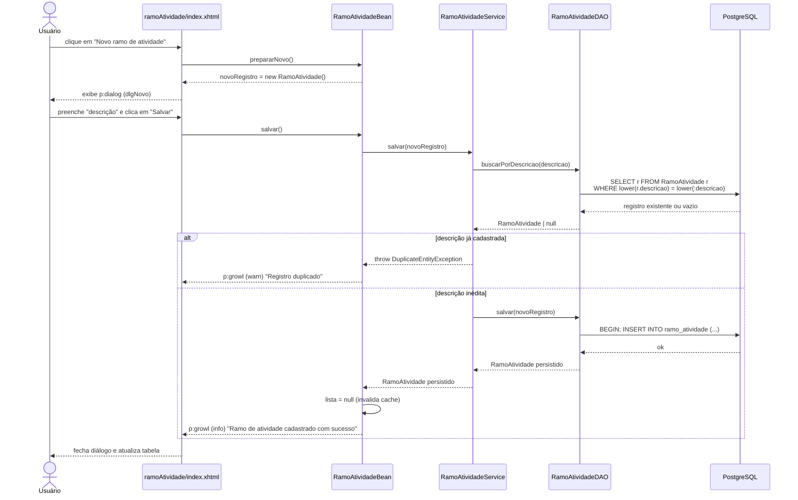
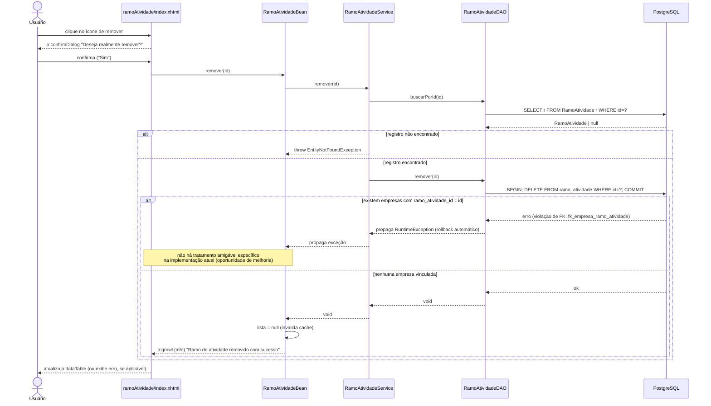
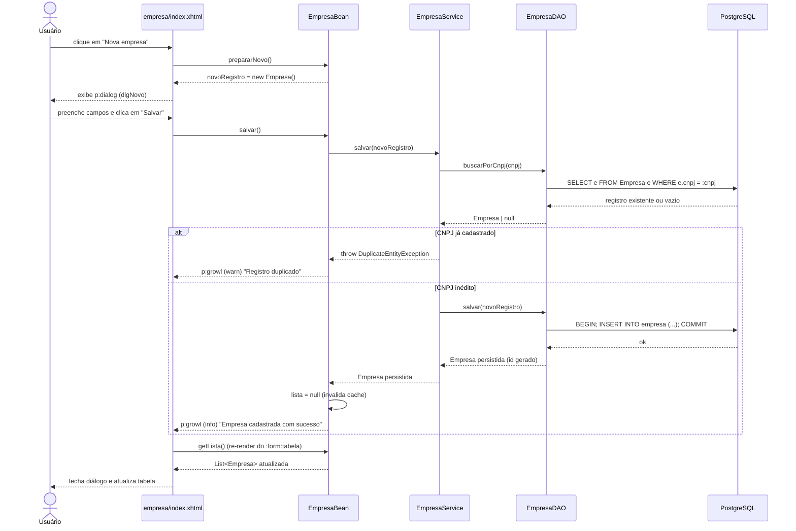
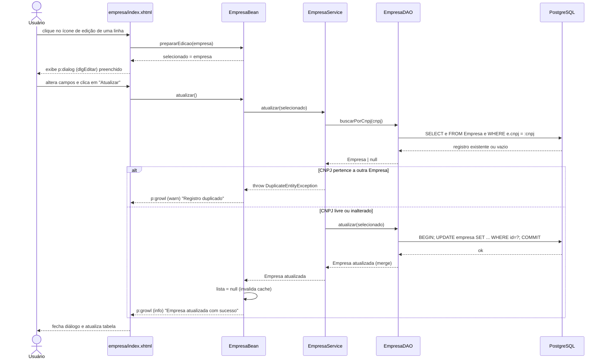
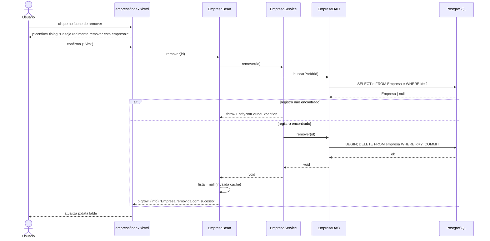
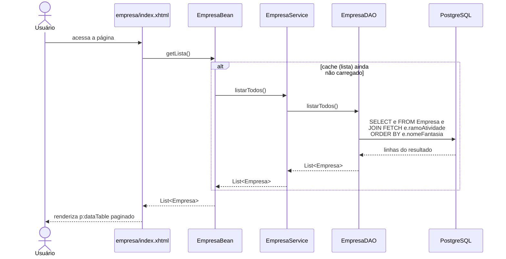
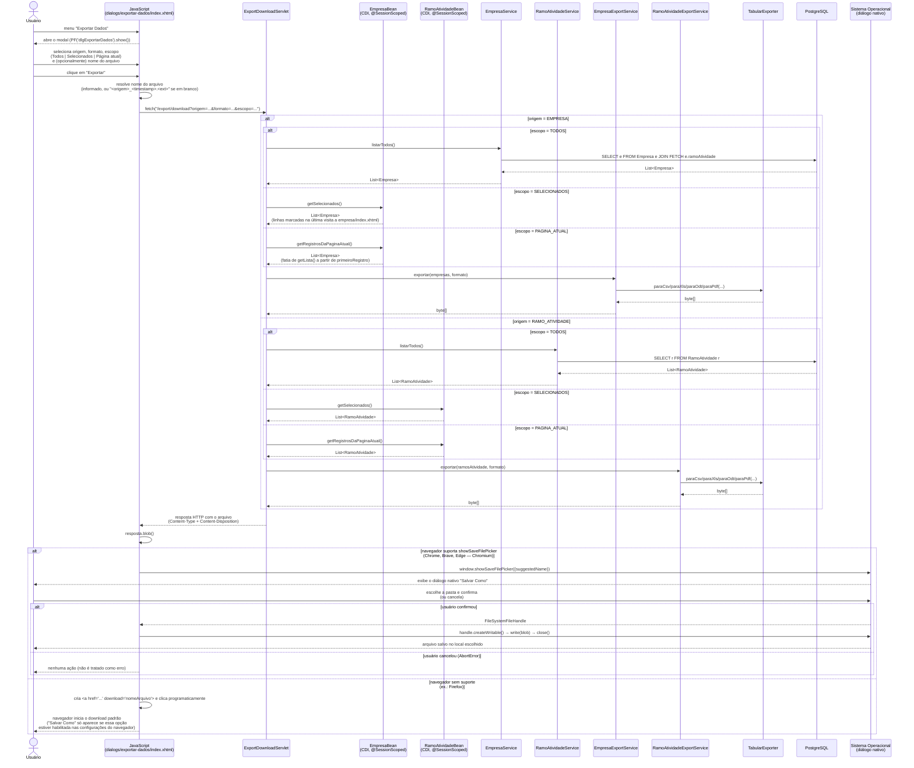
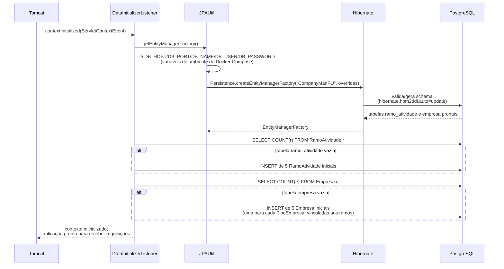

# RSData | CompanyMAN | Sequências principais

## TOC

<!-- TOC -->

- [RSData | CompanyMAN | Sequências principais](#rsdata--companyman--sequ%C3%AAncias-principais)
    - [TOC](#toc)
    - [Introdução](#introdu%C3%A7%C3%A3o)
    - [Requisitos funcionais](#requisitos-funcionais)
        - [UC1 - Cadastrar ramo de atividade](#uc1---cadastrar-ramo-de-atividade)
        - [UC3 - Remover ramo de atividade incluindo falha por integridade referencial](#uc3---remover-ramo-de-atividade-incluindo-falha-por-integridade-referencial)
        - [UC5 - Cadastrar empresa](#uc5---cadastrar-empresa)
        - [UC6 - Editar Empresa](#uc6---editar-empresa)
        - [UC7 - Remover Empresa](#uc7---remover-empresa)
        - [UC8 - Listar empresas](#uc8---listar-empresas)
        - [UC11 e UCV-UCU: Exportar Dados Save As nativo via File System Access API](#uc11-e-ucv-ucu-exportar-dados-save-as-nativo-via-file-system-access-api)
    - [Requisitos não-funcionais](#requisitos-n%C3%A3o-funcionais)
        - [UC00 - Inicialização da aplicação criação de schema e seed de dados](#uc00---inicializa%C3%A7%C3%A3o-da-aplica%C3%A7%C3%A3o-cria%C3%A7%C3%A3o-de-schema-e-seed-de-dados)
    - [O que deseja fazer?](#o-que-deseja-fazer)

<!-- /TOC -->
## Introdução

No que tange aos casos de uso já explorados seguem aqui os respectivos diagramas de sequência. As convenções adotadas em todos os diagramas são as seguintes:

- **View**: página Facelets/PrimeFaces (`empresa/index.xhtml` ou `ramoAtividade/index.xhtml`).
- **Bean**: managed bean CDI (`EmpresaBean` / `RamoAtividadeBean`).
- **Service**: camada de regras de negócio (`EmpresaService` / `RamoAtividadeService`).
- **DAO**: camada de acesso a dados (`EmpresaDAO` / `RamoAtividadeDAO`).
- **DB**: banco de dados PostgreSQL, acessado via Hibernate/JPA (`EntityManager`).

## Requisitos funcionais

### UC1 - Cadastrar ramo de atividade

Fluxo análogo ao de cadastro de Empresa, porém com verificação de duplicidade pela `descricao` (case-insensitive).

### UC3 - Remover ramo de atividade (incluindo falha por integridade referencial)

Este caso de uso evidencia uma regra de negócio implícita, garantida pelo banco de dados: um ramo de atividade não pode ser removido enquanto existirem empresas vinculadas a ele.

### UC5 - Cadastrar empresa

### UC6 - Editar Empresa

### UC7 - Remover Empresa

### UC8 - Listar empresas

Fluxo executado ao carregar a tela `empresa/index.xhtml` (idêntico, com os nomes trocados, para `ramoAtividade/index.xhtml`).

### UC11 e UCV-UCU: Exportar Dados (Save As nativo via File System Access API)

Fluxo disparado a partir do modal "Exportar Dados" (acessível pelo menu superior em qualquer tela). Diferente de um `p:commandButton` tradicional, a geração do arquivo e o disparo do diálogo nativo do navegador acontecem via JavaScript, consumindo um servlet dedicado (`com.empresa.export.ExportDownloadServlet`) através de `fetch()` — isso é necessário porque só assim é possível repassar os bytes para a **File System Access API** do navegador.

**Observações:**

- O mesmo modal atende às duas origens de dados; apenas o serviço de domínio (`EmpresaService`/`RamoAtividadeService`) e o serviço de exportação (`EmpresaExportService`/`RamoAtividadeExportService`) chamados pelo servlet mudam, conforme a origem selecionada.
- O **escopo** (`Todos os registros` / `Somente os selecionados` / `Somente a página atual`) determina se a exportação usa a listagem completa (`listarTodos()`) ou o estado atual do `p:dataTable` da tela de origem (seleção via checkboxes ou posição de paginação), lido diretamente de `EmpresaBean`/`RamoAtividadeBean` — injetados no servlet via CDI (`@Inject`).
- A geração do arquivo foi extraída para um servlet simples (`ExportDownloadServlet`), fora do ciclo de vida do JSF, porque o JavaScript precisa da resposta como `Blob` (via `fetch()`) para poder repassá-la ao `showSaveFilePicker()` — um postback JSF tradicional não permite isso. Isso também exige que os managed beans `@SessionScoped` sejam acessados via CDI (Weld), já que um servlet comum não participa do ciclo de vida do JSF por padrão.
- **Chrome, Brave e Edge** (Chromium) sempre exibem o diálogo nativo real de "Salvar Como", via File System Access API. O **Firefox não implementa essa API**; para ele, o modal cai em um link `<a download>` padrão, cujo comportamento depende da configuração de downloads do próprio navegador — uma limitação da plataforma web, não do servidor.

## Requisitos não-funcionais

### UC00 - Inicialização da aplicação (criação de schema e seed de dados)

Executado uma única vez, quando o contexto do Tomcat é iniciado.

---

## O que deseja fazer?

- [Voltar ao topo](#toc)
- [Voltar à raíz](../../../README.md)
- [Regras de negócio](./01-regras-de-negocio.md)
- [Entidades de domínio](./02-entidades-dominio.md)
- [Casos de uso](./03-casos-de-uso.md)
- [Validação e exportação](./05-validacao-exportacao.md)
- [Release notes](./06-release-notes.md)
- [Referência rápida](./07-referencia-rapida.md)
