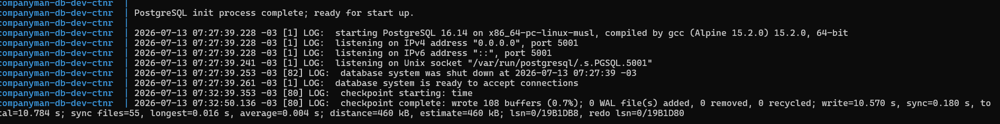
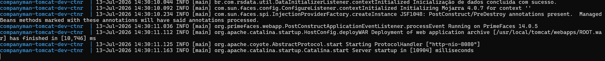
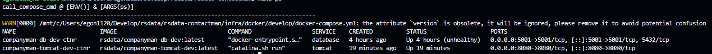
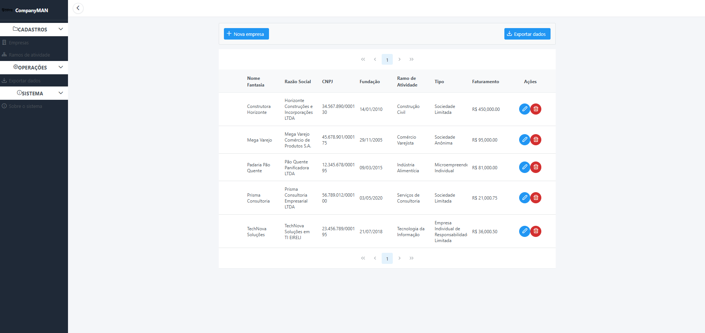

# RSData | CompanyMAN | Referência rápida

## TOC

<!-- TOC -->

- [RSData | CompanyMAN | Referência rápida](#rsdata--companyman--refer%C3%AAncia-r%C3%A1pida)
    - [TOC](#toc)
    - [Introdução](#introdu%C3%A7%C3%A3o)
    - [Incialização](#incializa%C3%A7%C3%A3o)
        - [WSL](#wsl)
        - [Plataforma](#plataforma)
            - [Banco de dados](#banco-de-dados)
            - [Servidor de aplicação](#servidor-de-aplica%C3%A7%C3%A3o)
    - [Primeiro acesso](#primeiro-acesso)
    - [O que deseja fazer?](#o-que-deseja-fazer)

<!-- /TOC -->

## Introdução

Aqui é apresentação uma sequência útil de interação com a plataforma de software em questão, desde o processo de build até a utilização da mesma como usuário.

> [!IMPORTANT]
>
> A estrutura do `Makefile` foi implementada tendo em vista que os comandos e scripts associados serão executados em um ambiente com suporte ao `bash`. Em um ambiente Windows, isso pode ser obtido, via Powershell, através da instalação do **Subsistema de Windows para Linux (WSL - _Windows Subsystem for Linux_)**. Para maiores informações, acesse a [documentação](https://learn.microsoft.com/pt-br/windows/wsl/install). Para este ambiente, foi usada a distribuição `Ubuntu` na instalação.

## Incialização

### WSL

Com o Powershell aberto, execute os seguintes comandos:

```powershell
wsl --install -d Ubuntu     # Instala o WSL para a distro específicda
wsl -d Ubuntu               # Inicia uma sessão do WSL no terminal para a distro especificada
```

### Plataforma

Similarmente ao exposto na raíz dessa documentação, a inicialização dos serviços necessários, i.e. servidores de banco de dados e de aplicação (PostgreSQL e Apache Tomcat), é realizada através de scripts do `make`. Com efeito:

#### Banco de dados

```bash
make build c=database       # Faz a build da imagem Docker
make init c=database        # Inicia o contêiner com logs
```

Caso tudo ocorra sem erros, Caso tudo ocorra sem erros, o servidor PostgreSQL estará aceitando conexões na porta 5001, com os logs apresentando:



#### Servidor de aplicação

```bash
make build c=tomcat       # Faz a build da imagem Docker
make init c=tomcat        # Inicia o contêiner com logs
```

Caso tudo ocorra sem erros, Caso tudo ocorra sem erros, o servidor Tomcat estará aceitando conexões na porta 8080, com os logs apresentando:



> [!NOTE]
>
> Equivalentemente, maiores informações acerca dos contêineres podem ser obtidas através do comando `make ps`:
>
> 

## Primeiro acesso

De posse de um navegador web, o sistema CompanyMAN pode agora ser acessado através de [http://localhost:8080](http://localhost:8080). A tela inicial do sistema, nesta versão, correspondo ao CRUD de empresas:



> [!NOTE]
>
> Os navegadores nos quais o sistema foi testado foram:
> - Google Chrome
> - Brave Browser
> - Microsoft Edge
> - Mozilla Firefox
>
> Caso anormalidades sejam detectadas, favor [entrar em contato](mailto:gulherme.goncalves@rsdata.inf.br) com o desenvolvedor do sistema.

---

## O que deseja fazer?

- [Voltar ao topo](#toc)
- [Voltar à raíz](../../../README.md)
- [Regras de negócio](./01-regras-de-negocio.md)
- [Entidades de domínio](./02-entidades-dominio.md)
- [Casos de uso](./03-casos-de-uso.md)
- [Sequências principais](./04-sequencias-principais.md)
- [Validação e exportação](./05-validacao-exportacao.md)
- [Release notes](./06-release-notes.md)
